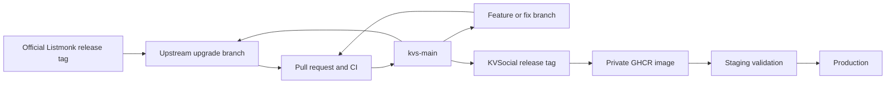

# KVSocial Listmonk development and maintenance handbook

This document is the operating guide for KVSocial's Listmonk fork. It explains
where custom work belongs, how changes reach production, and how to integrate a
new upstream Listmonk release without replaying every KVSocial commit.

Repository: <https://github.com/KVSocial/listmonk>

## The short version

- `upstream` is the official `knadh/listmonk` repository.
- `master` mirrors upstream development and must not contain KVSocial features.
- `kvs-main` is KVSocial's production source branch.
- Every feature, fix, and upstream upgrade starts on its own branch from
  `kvs-main` and returns through a pull request.
- Production runs immutable tags such as `v6.2.0-kvs.1`, never a branch and
  never `kvs-latest`.
- A KVSocial tag starts GitHub Actions, which publishes the corresponding GHCR
  image.

## Production operations documentation

Day-to-day production procedures for Listmonk are maintained in the [KVSocial team knowledge base](https://github.com/KVSocial/team-knowledge/tree/main/Listmonk).

This handbook documents the fork, release, deployment, upgrade, and rollback workflow. Use the team knowledge base for production backups, monitoring, incident response, access, and server operations.



## Ownership and visibility

`KVSocial/listmonk` is a fork of a public repository. GitHub keeps forks in the
same public repository network, so the source code and KVSocial modifications
are visible. Do not describe the source repository as private.

The GHCR package can still be private. A private package prevents unauthorized
users from pulling the prebuilt image, but it does not make the public source
private. Confirm package visibility after the first publication and after any
package-permission change.

Never share the KVSocial GitHub password. Grant collaborators access through
their own GitHub accounts. Production should pull the image with a dedicated,
read-only package credential rather than a developer's personal token.

Listmonk is AGPL-licensed. Keep copyright and license notices intact and review
the corresponding-source obligations when deploying modified versions. Ask
qualified counsel if the distribution or network-use obligations are unclear.

## Branch and remote model

| Name | Purpose | Rules |
| --- | --- | --- |
| `upstream` | Official `knadh/listmonk` repository | Fetch only; never push |
| `origin` | KVSocial fork | Push feature branches, `kvs-main`, and KVSocial tags |
| `master` | Clean mirror of upstream development | No KVSocial commits |
| `kvs-main` | Reviewed KVSocial production source | PRs only; do not develop directly here |
| `utsav-ai/<topic>` | Feature, fix, documentation, or upgrade branch | Delete after merge when no longer needed |

Set `kvs-main` as the default branch in the KVSocial repository settings. This
makes new pull requests target the correct branch and makes the KVSocial
workflows easy to find. `master` still remains available as the clean upstream
mirror.

## One-time local setup

Clone the KVSocial fork and add the official project as `upstream`:

```sh
git clone git@github.com:KVSocial/listmonk.git
cd listmonk

git remote add upstream https://github.com/knadh/listmonk.git
git remote set-url --push upstream DISABLED

git fetch origin --branches --tags
git fetch upstream --branches --tags
```

If this Mac uses a GitHub SSH alias, the `origin` URL may instead look like:

```text
git@github-shrestsav:KVSocial/listmonk.git
```

Verify the setup:

```sh
git remote -v
git branch -a
git status --short --branch
```

Expected result:

- `origin` points to `KVSocial/listmonk`.
- `upstream` fetches from `knadh/listmonk`.
- pushing to `upstream` is disabled.
- normal work targets `kvs-main`.

## Developing a feature or fix

### 1. Start from the latest reviewed KVSocial code

```sh
git fetch origin
git switch kvs-main
git pull --ff-only origin kvs-main
git status --short
```

Stop if the worktree contains unrelated changes. Preserve or move those changes
before starting a new branch.

### 2. Create one focused branch

```sh
git switch -c utsav-ai/<short-feature-name>
```

Examples:

```text
utsav-ai/sendgrid-campaign-attribution
utsav-ai/fix-bounce-counter
utsav-ai/document-maintenance-workflow
```

Keep one logical feature or fix per branch. Do not develop directly on
`kvs-main` or `master`.

### 3. Implement with tests

Before editing, find the real code path and establish the current behavior.
Prefer a small, isolated change over broad rewrites. Add tests that fail before
the fix and pass after it.

Minimum backend validation:

```sh
go test ./...
git diff --check
```

When frontend code changes:

```sh
corepack enable
corepack prepare yarn@1.22.22 --activate
make build-frontend
```

When release/build code changes, also validate the relevant GoReleaser or Docker
configuration. For changes involving SMTP, bounces, migrations, authentication,
or data, perform a controlled integration test in addition to unit tests.

### 4. Review the exact change

```sh
git status --short
git diff
git diff --check
```

Stage only the intended files:

```sh
git add path/to/file1 path/to/file2
git diff --cached
```

Do not use `git add -A` in a worktree containing unrelated files.

### 5. Commit, push, and open a PR

```sh
git commit -m "Describe the change"
git push -u origin "$(git branch --show-current)"
```

Open a pull request with:

- base: `kvs-main`
- head: the feature branch
- a concise explanation of what changed and why
- test evidence
- deployment or migration notes
- a rollback note for risky changes

`KVSocial CI` runs `go test ./...` for PRs into `kvs-main`. Merge only after the
required review and CI pass.

## Releasing a KVSocial image

### Version format

Use:

```text
v<upstream-version>-kvs.<revision>
```

Examples:

```text
v6.2.0-kvs.1
v6.2.0-kvs.2
v7.0.0-kvs.1
```

Rules:

- Start at `.1` for the first KVSocial release based on a new upstream version.
- Increase the KVSocial revision for every subsequent release on that upstream
  version.
- Never move, delete, or reuse a published tag.
- Production must use the immutable version tag, not `kvs-latest`.

### Release procedure

1. Confirm every intended PR is merged into `kvs-main`.
2. Confirm `KVSocial CI` is green on the latest `kvs-main` commit.
3. Fetch the exact remote commit and tags.
4. Create an annotated tag on that commit.
5. Push only the tag.

```sh
git fetch origin kvs-main --tags

git rev-parse origin/kvs-main

git tag -a v6.2.0-kvs.1 origin/kvs-main \
  -m "KVSocial Listmonk v6.2.0-kvs.1"

git push origin v6.2.0-kvs.1
```

The `KVSocial GHCR release` workflow then:

1. confirms the tagged commit belongs to `kvs-main`;
2. runs `go test ./...`;
3. builds the frontend and packed Listmonk binary;
4. builds AMD64 and ARM64 images;
5. publishes the multi-platform image to GHCR.

Expected images:

```text
ghcr.io/kvsocial/listmonk:v6.2.0-kvs.1
ghcr.io/kvsocial/listmonk:kvs-latest
```

The upstream workflow named `goreleaser` is expected to be skipped in this fork.
The KVSocial workflow is the one that must succeed.

After the first publication:

- open the KVSocial account's Packages section;
- confirm the `listmonk` package is private;
- confirm the tag and supported architectures;
- retain package access for the repository workflow;
- grant production only read access.

No Docker Hub credentials are required. GitHub Actions publishes with the
repository-scoped `GITHUB_TOKEN`.

## Production package authentication

Use a company-controlled machine account or credential with package read access.
Do not grant write or delete access to the production server.

Authenticate without printing the token:

```sh
printf '%s' "$GHCR_READ_TOKEN" | \
  docker login ghcr.io -u KVSocial --password-stdin
```

Store the token in an approved secret manager or a root-readable server secret.
Do not commit it to Git, put it in the image, paste it into documentation, or
leave it in shell history.

## Production deployment

The examples below assume the production Compose service is named `app`. Confirm
service names first:

```sh
cd /root/listmonk
docker compose --env-file .env -f compose.yml config --services
```

### 1. Record and back up the current state

Record:

- currently deployed image tag;
- current Git commit and KVSocial release tag;
- Compose and `.env` locations;
- database backup filename;
- deployment time and operator.

Create a PostgreSQL backup before image or upstream-version changes:

```sh
mkdir -p backups

docker compose --env-file .env -f compose.yml exec -T db sh -lc \
  'pg_dump -U "$POSTGRES_USER" "$POSTGRES_DB"' | \
  gzip > "backups/listmonk-$(date -u +%Y%m%dT%H%M%SZ).sql.gz"
```

Confirm the backup is present and non-empty before continuing.

### 2. Pin the new image

In `compose.yml`, use the immutable image:

```yaml
image: ghcr.io/kvsocial/listmonk:v6.2.0-kvs.1
```

Do not deploy `kvs-latest` in production.

### 3. Pull and restart only Listmonk

```sh
docker compose --env-file .env -f compose.yml pull app
docker compose --env-file .env -f compose.yml up -d app
docker compose --env-file .env -f compose.yml ps
docker compose --env-file .env -f compose.yml logs --tail=200 app
```

Do not recreate or remove the database volume during a normal application
deployment.

### 4. Smoke-test

Verify:

```sh
curl -fsS https://email.kvsocial.com/api/health
```

Also confirm:

- admin login works;
- the expected version is shown;
- lists, subscribers, campaigns, and templates load;
- SMTP test delivery succeeds;
- no migration, database, or template errors appear in logs.

## Controlled SendGrid delivery lifecycle validation

For delivery-event and automatic campaign-attribution changes:

1. Before deployment, confirm there are no running or paused campaigns and take
   the PostgreSQL backup required above.
2. Keep only `Bounced` enabled on the existing signed SendGrid webhook while the
   new image and `v6.2.1-kvs.1` migration are deployed.
3. Confirm the app is healthy and the migration created
   `campaign_delivery_events` before changing SendGrid.
4. Enable `Processed`, `Dropped`, `Deferred`, `Bounced`, and `Delivered` on the
   same signed endpoint. Do not enable SendGrid engagement events.
5. Run SendGrid's Test Integration and confirm
   `POST /webhooks/service/sendgrid` returns HTTP 200. Sample events without
   Listmonk correlation metadata are expected to be ignored.
6. Do not add a manual `X-SMTPAPI` header. Create a one-subscriber private test
   list and send to a controlled valid inbox.
7. Confirm lifecycle rows contain non-empty campaign and subscriber IDs, a
   unique provider event ID, and a `delivered` event.
8. Confirm the campaign listing reports Delivered, Unique Views, Unique Clicks,
   and their expected rates.
9. Repeat with a controlled address that produces a real hard bounce. Confirm
   the bounce is attributed, counted once, and applies the configured subscriber
   blocklist policy.
10. Replay a captured signed test payload in a safe environment and confirm the
    unique provider event ID prevents duplicate lifecycle rows and bounce side
    effects.

Database verification:

```sql
SELECT
    b.id,
    s.email,
    b.type,
    b.source,
    b.campaign_id,
    b.created_at
FROM bounces b
LEFT JOIN subscribers s ON s.id = b.subscriber_id
ORDER BY b.id DESC
LIMIT 10;

SELECT
    e.id,
    e.campaign_id,
    e.subscriber_id,
    e.provider,
    e.provider_event_id,
    e.provider_message_id,
    e.event_type,
    e.occurred_at
FROM campaign_delivery_events e
ORDER BY e.id DESC
LIMIT 20;
```

For this feature to be considered working, lifecycle `provider` should be
`sendgrid`, `campaign_id` must be populated, and each real successful test send
must produce one `delivered` event. The controlled bounce must still have
`source=sendgrid`, `type=hard`, and a populated `campaign_id`.

Campaigns started before `delivery.sendgrid_tracking_started_at` intentionally
show an estimated Delivered value calculated as `MAX(sent - bounces, 0)`.
Campaigns started after that timestamp must use actual provider events only.

If rollback is required, disable `Processed`, `Dropped`, `Deferred`, and
`Delivered` before restoring the previous image; leave `Bounced` enabled so the
older handler continues processing bounces. The delivery-event migration is
additive and may remain unless the rollback assessment requires restoring the
pre-deployment backup.

## Production SendGrid validation record

The production SendGrid path was validated on 29 July 2026 using only internal
test recipients.

Verified:

- production delivered through `smtp.sendgrid.net` using the KVSocial custom
  image `ghcr.io/kvsocial/listmonk:v6.2.0-kvs.1`;
- Gmail received the message in approximately three seconds;
- Gmail's original-message view reported SPF, DKIM, and DMARC as passing;
- DKIM aligned with `kvsocialmail.com`;
- tracked links incremented Listmonk campaign click analytics;
- individual open tracking produced subscriber-specific Listmonk pixel URLs;
- the public unsubscribe page used `https://email.kvsocial.com` and changing
  one list subscription to `Unsubscribed` left the subscriber enabled globally;
- a later campaign to the same four-person list sent to `3 / 3`, confirming the
  unsubscribed list member was excluded;
- replying from Gmail addressed the response to `neil@kvsocialmail.com`, and
  Zoho Desk received it as KV Social support ticket `#83708`, confirming the
  sender identity routes replies to a monitored operational destination;
- a controlled SendGrid hard bounce reached the signed webhook, was attributed
  to the correct campaign, and blocklisted the subscriber;
- the campaign email contained `List-Unsubscribe` and
  `List-Unsubscribe-Post` headers.

### Tracking URL behavior

Listmonk generates subscriber-specific URLs when individual tracking is
enabled:

```text
https://email.kvsocial.com/link/<link-uuid>/<campaign-uuid>/<subscriber-uuid>
https://email.kvsocial.com/campaign/<campaign-uuid>/<subscriber-uuid>/px.png
```

SendGrid may then wrap the Listmonk click URL with the authenticated branded
tracking domain:

```text
https://url8090.kvsocialmail.com/ls/click?...<encoded-listmonk-url>...
```

This double wrapping is expected: SendGrid records the outer redirect and
Listmonk records the inner redirect. Listmonk remains the campaign reporting
source of truth. Do not disable SendGrid tracking account-wide without first
confirming that no other application sharing the SendGrid account depends on
it.

Open counts are not guaranteed to equal the number of messages opened. Gmail
serves images through a proxy and can cache identical pixel URLs. Individual
tracking must remain enabled when per-subscriber open attribution is required;
even then, open tracking is an estimate rather than proof that a human read the
message.

### Known provider limitations

- Listmonk's native SendGrid handler records supported bounce events but does
  not import SendGrid spam-report events.
- SendGrid `deferred` events are not recorded as Listmonk soft bounces.
- Provider-side unsubscribe or suppression changes are not automatically
  mirrored into Listmonk subscriptions.
- SMTP.com validation is a separate workstream and is not implied by this
  SendGrid result.

## Local MCP connection to production

KVSocial uses the unofficial community package `listmonk-mcp` as a local stdio
process. The MCP process is not exposed as a public web service. It connects
from the developer's machine to the normal production Listmonk API at
`https://email.kvsocial.com`.

The package's `0.1.0` dependency declaration permits incompatible `mcp 2.x`
releases. Pin the MCP SDK below version 2 when launching it:

```toml
[mcp_servers.listmonk]
command = "/opt/homebrew/bin/uvx"
args = ["--with", "mcp<2", "listmonk-mcp"]
env_vars = ["LISTMONK_MCP_PASSWORD"]
default_tools_approval_mode = "prompt"
startup_timeout_sec = 30
tool_timeout_sec = 60

[mcp_servers.listmonk.env]
LISTMONK_MCP_URL = "https://email.kvsocial.com"
LISTMONK_MCP_USERNAME = "codex-mcp"
```

`LISTMONK_MCP_PASSWORD` is the dedicated production API user's one-time token.
Keep it outside Git, documentation, Asana, and the static TOML file. The API
user must not receive `campaigns:send`. A draft-only role may receive focused
read permissions plus `campaigns:manage` for its permitted internal test list.
Keep MCP tool approval mode set to `prompt`.

Validate in this order:

1. MCP health;
2. permitted mailing-list retrieval;
3. subscriber lookup;
4. campaign retrieval;
5. creation of a clearly named draft campaign on the internal test list.

Do not send the draft. Confirm that sending, global management, user
administration, settings, SQL, and unrelated-list operations are denied.

## Rolling back a deployment

### Application-only rollback

If the new version has not introduced an incompatible database migration:

1. change `compose.yml` back to the previous immutable image tag;
2. pull that image;
3. recreate only the Listmonk service;
4. run the smoke tests again.

```sh
docker compose --env-file .env -f compose.yml pull app
docker compose --env-file .env -f compose.yml up -d app
docker compose --env-file .env -f compose.yml ps
docker compose --env-file .env -f compose.yml logs --tail=200 app
```

### Database-aware rollback

Do not assume an older application binary can safely use a schema modified by a
newer upstream release. If migrations are involved:

- stop the application;
- assess the migration and rollback compatibility;
- restore the pre-deployment PostgreSQL backup when required;
- then deploy the previous image.

Never delete the production database volume as a rollback method.

## Integrating a new upstream Listmonk release

This is a merge-based process. It merges one upstream release into the existing
KVSocial history; it does not cherry-pick every KVSocial commit again.

Assume the new official release is `v7.0.0`.

### 1. Update the clean upstream mirror

```sh
git fetch upstream --branches --tags
git fetch origin --branches --tags

git switch master
git merge --ff-only upstream/master
git push origin master
```

Do not add KVSocial features to `master`.

### 2. Create the upgrade branch from KVSocial code

```sh
git switch kvs-main
git pull --ff-only origin kvs-main
git switch -c utsav-ai/upgrade-v7.0.0
```

### 3. Inspect and merge the official release tag

Inspect the tag and upstream release notes before merging:

```sh
git show --stat v7.0.0
git log --oneline --decorate v6.2.0..v7.0.0
```

Merge the release tag:

```sh
git merge --no-ff v7.0.0
```

If conflicts occur:

```sh
git status
git diff --name-only --diff-filter=U
```

Resolve each conflict based on intended behavior, not by blindly choosing
"ours" or "theirs" for every file. Preserve KVSocial tests and re-implement a
customization when upstream has substantially redesigned the surrounding code.

After resolving a file:

```sh
git add path/to/resolved-file
```

Complete the merge when every conflict is resolved:

```sh
git commit
```

If the upgrade needs to be abandoned safely:

```sh
git merge --abort
```

### 4. Validate the upgrade

At minimum:

```sh
go test ./...
make build-frontend
git diff --check
```

Then build the candidate image and validate it in staging with a copy or safe
snapshot of production data. Review upstream release notes for:

- required database migrations;
- configuration changes;
- removed or renamed settings;
- template changes;
- API or webhook changes;
- dependency/runtime changes;
- security fixes;
- backup or rollback limitations.

Repeat the critical KVSocial tests, especially SendGrid delivery, signed bounce
webhooks, campaign attribution, blocklisting, authentication, and migrations.

### 5. Review and release

Push the upgrade branch and open a PR into `kvs-main`:

```sh
git push -u origin utsav-ai/upgrade-v7.0.0
```

The PR should list:

- upstream version and release notes;
- conflicts and their resolutions;
- KVSocial customizations revalidated;
- migration and configuration changes;
- staging evidence;
- production rollout and rollback plan.

After review and merge, publish the first KVSocial tag for the new base:

```text
v7.0.0-kvs.1
```

## Hotfixes

For an urgent production fix:

1. branch from the current `kvs-main`;
2. make the smallest safe change;
3. add a regression test;
4. open an expedited PR into `kvs-main`;
5. run CI and focused integration tests;
6. release the next KVSocial revision;
7. deploy the immutable image;
8. document the incident and follow-up work.

Example:

```text
v6.2.0-kvs.1 -> v6.2.0-kvs.2
```

Do not patch a running container, force-push `kvs-main`, or move an existing tag.

## Security and access checklist

- Require individual GitHub accounts for collaborators.
- Enable two-factor authentication on accounts with write or admin access.
- Protect `kvs-main` and require pull requests and CI before merging.
- Keep `upstream` push disabled locally.
- Keep GHCR private unless there is an explicit decision to make it public.
- Use a read-only production package credential.
- Never commit `.env`, SMTP keys, webhook keys, database passwords, or tokens.
- Rotate credentials when access changes or exposure is suspected.
- Keep production PostgreSQL private and reachable only through approved paths.
- Retain the Listmonk license and notices.

## Recovery checklist

Keep enough information to rebuild or restore the service without relying on a
single developer machine:

- Git repository and immutable release tag;
- GHCR image tag and, preferably, image digest;
- Compose file and non-secret configuration;
- secret-manager entries and documented access owners;
- PostgreSQL backups with tested restore instructions;
- media/upload storage backups;
- DNS, TLS, SMTP, and webhook configuration;
- the last known-good image and database backup pair.

A tagged image can be rebuilt from Git if GHCR is unavailable. A database cannot
be reconstructed from Git, so backup and restore testing are mandatory.

## Pull request checklist

Before merging into `kvs-main`:

- [ ] The branch started from the latest `kvs-main`.
- [ ] The change is focused and explained.
- [ ] Unit or regression tests cover the behavior.
- [ ] `go test ./...` passes.
- [ ] Frontend or release checks pass when relevant.
- [ ] `git diff --check` passes.
- [ ] Migrations and configuration changes are documented.
- [ ] Integration evidence is attached for risky workflows.
- [ ] Deployment and rollback impact is understood.
- [ ] No secrets or unrelated files are included.

## Release checklist

- [ ] All intended PRs are merged into `kvs-main`.
- [ ] CI is green on the exact release commit.
- [ ] The tag follows `v<upstream>-kvs.<revision>`.
- [ ] The tag points to a commit contained in `kvs-main`.
- [ ] `KVSocial GHCR release` succeeds.
- [ ] The versioned AMD64/ARM64 image exists.
- [ ] GHCR visibility and access are correct.
- [ ] Database and configuration backups exist.
- [ ] Staging validation passes.
- [ ] Production uses the immutable versioned tag.
- [ ] Smoke tests and critical integration tests pass.
- [ ] The deployed version, time, operator, and rollback target are recorded.
