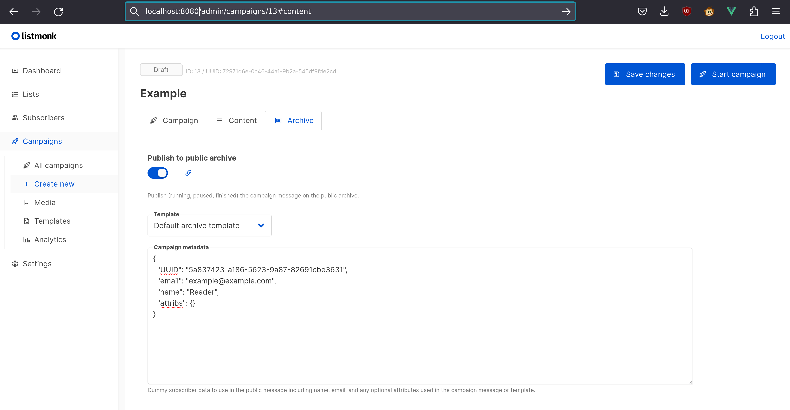

# Archives

A global public archive is maintained on the public web interface. It can be
enabled under Settings -> Settings -> General -> Enable public mailing list
archive.

To make a campaign available in the public archive (provided it has been
enabled in the settings as described above), enable the option
'Publish to public archive' under Campaigns -> Create new -> Archive.

When using template variables that depend on subscriber data (such as any
template variable referencing `.Subscriber`), such data must be supplied
as 'Campaign metadata', which is a JSON object that will be used in place
of `.Subscriber` when rendering the archive template and content.

When individual subscriber tracking is enabled, TrackLink requires that a UUID
of an existing user is provided as part of the campaign metadata. Any clicks on
a TrackLink from the archived campaign will be counted towards that subscriber.

As an example:

```json
{
  "UUID": "5a837423-a186-5623-9a87-82691cbe3631",
  "email": "example@example.com",
  "name": "Reader",
  "attribs": {}
}
```



