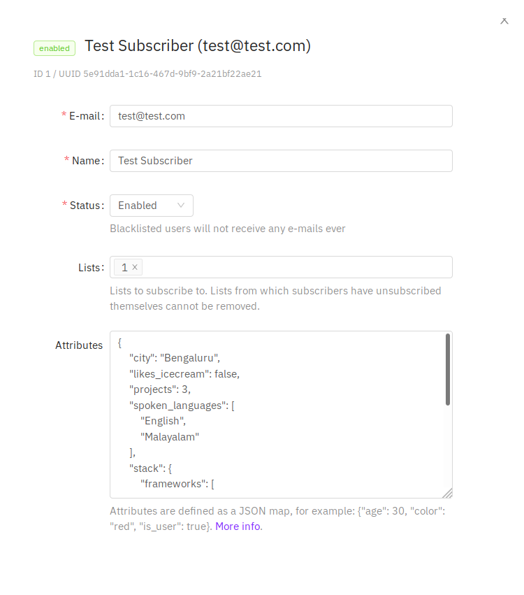
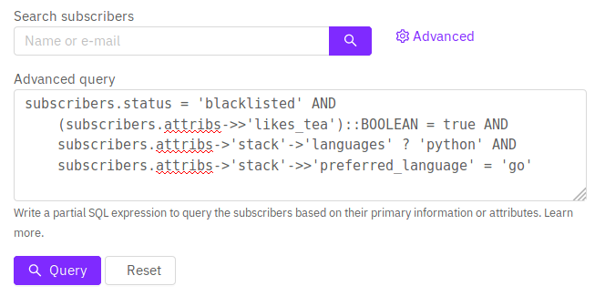

# Querying and segmenting subscribers

listmonk allows the writing of partial Postgres SQL expressions to query, filter, and segment subscribers.

## Database fields

These are the fields in the subscriber database that can be queried.

| Field                    | Description                                                                                         |
| ------------------------ | --------------------------------------------------------------------------------------------------- |
| `subscribers.uuid`       | The randomly generated unique ID of the subscriber                                                  |
| `subscribers.email`      | E-mail ID of the subscriber                                                                         |
| `subscribers.name`       | Name of the subscriber                                                                              |
| `subscribers.status`     | Status of the subscriber (enabled, disabled, blocklisted)                                           |
| `subscribers.attribs`    | Map of arbitrary attributes represented as JSON. Accessed via the `->` and `->>` Postgres operator. |
| `subscribers.created_at` | Timestamp when the subscriber was first added                                                       |
| `subscribers.updated_at` | Timestamp when the subscriber was modified                                                          |

## Sample attributes

Here's a sample JSON map of attributes assigned to an imaginary subscriber.

```json
{
  "city": "Bengaluru",
  "likes_tea": true,
  "spoken_languages": ["English", "Malayalam"],
  "projects": 3,
  "stack": {
    "frameworks": ["echo", "go"],
    "languages": ["go", "python"],
    "preferred_language": "go"
  }
}
```



## Sample SQL query expressions



#### Find a subscriber by e-mail

```sql
-- Exact match
subscribers.email = 'some@domain.com'

-- Partial match to find e-mails that end in @domain.com.
subscribers.email LIKE '%@domain.com'

```

#### Find a subscriber by name

```sql
-- Find all subscribers whose name start with John.
subscribers.email LIKE 'John%'

```

#### Multiple conditions

```sql
-- Find all Johns who have been blocklisted.
subscribers.email LIKE 'John%' AND status = 'blocklisted'
```

#### Querying attributes

```sql
-- The ->> operator returns the value as text. Find all subscribers
-- who live in Bengaluru and have done more than 3 projects.
-- Here 'projects' is cast into an integer so that we can apply the
-- numerical operator >
subscribers.attribs->>'city' = 'Bengaluru' AND
    (subscribers.attribs->>'projects')::INT > 3
```

#### Querying nested attributes

```sql
-- Find all blocklisted subscribers who like to drink tea, can code Python
-- and prefer coding Go.
--
-- The -> operator returns the value as a structure. Here, the "languages" field
-- The ? operator checks for the existence of a value in a list.
subscribers.status = 'blocklisted' AND
    (subscribers.attribs->>'likes_tea')::BOOLEAN = true AND
    subscribers.attribs->'stack'->'languages' ? 'python' AND
    subscribers.attribs->'stack'->>'preferred_language' = 'go'

```

To learn how to write SQL expressions to do advancd querying on JSON attributes, refer to the Postgres [JSONB documentation](https://www.postgresql.org/docs/11/functions-json.html).
